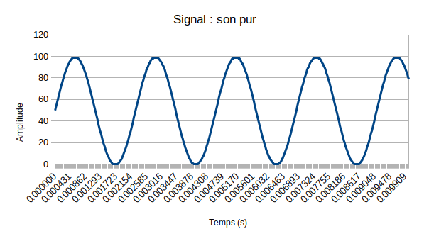

# TP Son - Lukas Fauchois

L'objectif de ce TP est de manipuler le son, notamment par le biais du Time-Stretching. Pour information, afin de compiler les différents programmes, il y a un Makefile par répertoire ainsi qu'un Makefile "général" dans le répertoire principal. De plus, chaque fichier .WAV généré se trouve dans le répertoire associé à l'exécutable.

## Les fichiers WAV

### main
- L'archive contient un exemple d'utilisation de la classe d'extraction de fichiers WAV. Afin de compiler, j'utilise l'utilitaire g++ :

  > g++ -lm main.cpp fft.cpp wavdata.cpp -o exec -Wall -Wextra

  L'objectif de ce premier exemple est de doubler la durée du fichier WAV afin d'y ajouter un effet de "Delay". Cet effet sonore est basé sur le principe de l'écho, le programme permet de décaler le signal d'entrée dans le temps *(DELAY = 5000)* et de la répéter régulièrement avec une amplitude inférieur à l'amplitude du signal initial *(AMPLITUDE = 0,5)*.

  Concernant les informations retournées par le programme dans la console, je constate 3 blocs principaux codés dans le programme *wavdata.cpp* :
    * Un bloc de déclaration d'un fichier au format WAVE : ce bloc nous donne différentes informations sur le fichier chargé par la fonction **load()** telles que l'ID, sa taille et son format.
    * Un bloc décrivant le format audio : ce bloc nous donne les informations concernant le format, dans notre cas le format .WAV.
    * Un bloc de données : ce bloc indique l'ID des données ainsi que le nombre d'octets de données.

### son_pur
- A partir de cet exemple, nous allons pourvoir créer un fichier audio sur lequel on trouvera un son pur. Un son pur étant un son dont l'onde est parfaitement sinusoïdale, j'utilise la formule suivant **AMPLITUDE x (sin(omega x t)+1)** avec **omega = 2 x PI x fréquence de hauteur du LA** et **t = i / fréquence d'échantillonage**. En sauvegardant les échantillons dans un classeur, nous visualisons le signal suivant :

### son_etire
- Afin d'étirer la durée de la trame sonore, je dédouble mes échantillons, ce qui me permet de doubler, en durée, ma trame. Aux niveaux de la fréquence du son pur, on constate un changement de fréquence. De la même façon, avec un signal complexe on constate une élongation dans le domaine temporel mais les fréquences sont modifiées. Nous allons désormais utiliser le Time-Stretching afin de changer la durée d'un échantillon sonore sans en modifier le ton.

## Time-stretching

### time_stretching

- Pour un signal pur, une dilatation de l'échelle de fréquences correspond à une contraction inverse de l'échelle temporelles. Réciproquement, la dilatation de l'échelle des temps conduit à une contraction inverse de l'échelle fréquentielle. C'est le théorème du changement d'échelle de la transformée de Fourier. L'objectif du découpage initial est d'effectuer un allongement du son dans le domaine temporelle tout en conservant les fréquences initiales, d'où l'utilité d'effectuer les deux dilatations séparemmment.

- Afin d'effectuer le découpage du son, nous disposons de la transformée de Fourier qui va nous permettre de découper la trame sonore et la dilatation du spectre de fréquence. Afin d'effectuer cette dilatation, je dédouble mes valeurs dans le domaine fréquentiel (**long_audio_f**) avant de repasser dans le domaine temporel à l'aide de la transformée de Fourier inverse.

- Contrairement à la dilatation temporelle réalisée dans la partie 2, on constate que les fréquences sont conservées mais que la durée de la trame est doublée. J'en conclue que le time-stretching a bien eu l'effet escompté.

# Compression audio

Pas eu le temps de finir
